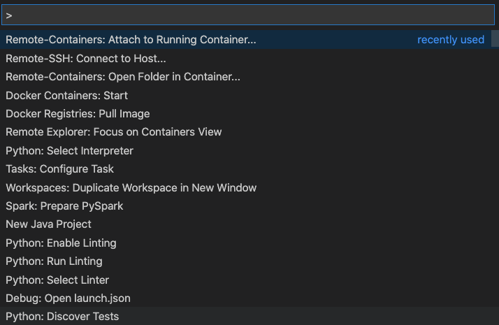

# VScode containerised remote ssh development
source `https://stackoverflow.com/a/63617958/1312802`
1. Install the Remote-Containers extension


2. Open the docker.host setting in the your `setting.json`


2. Change the server here to the user and ssh remote machine address
   `ssh://your-remote-user@your-remote-machine-fqdn-or-ip-here`


   
3. ssh into your remote server and set up a container based on the image you have built before, also don't forget to bind your project volume to the container instance.
   ```
   docker run -d -it --name devcontainer --mount type=bind,source="$(pwd)"/target,target=/app devimage
   ```

4. Come back to the VScode and open command palette and select following option:



5. Select your remote container on the server


You are good to go!
   