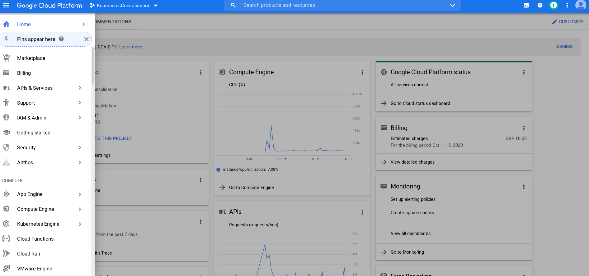
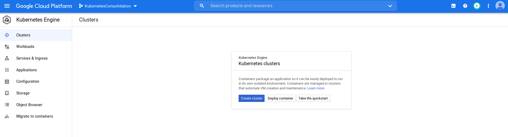
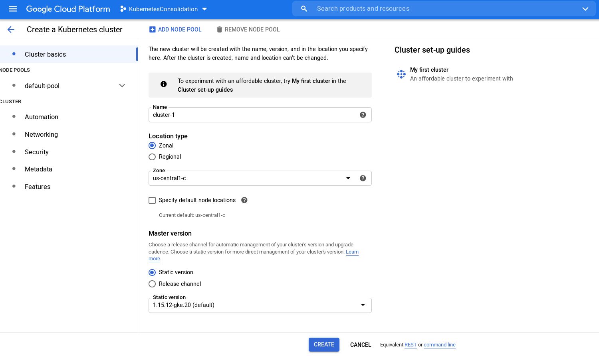
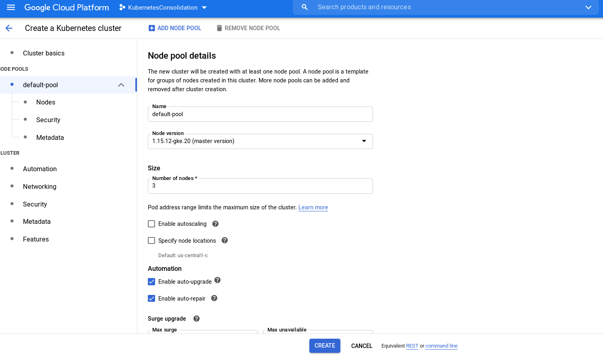
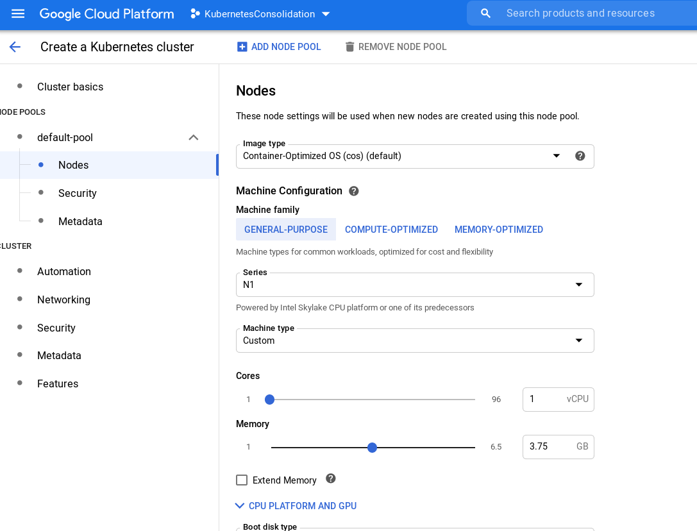
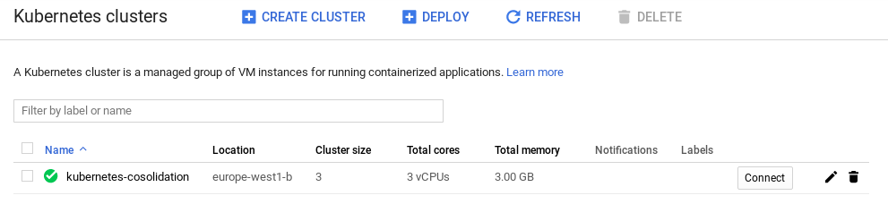
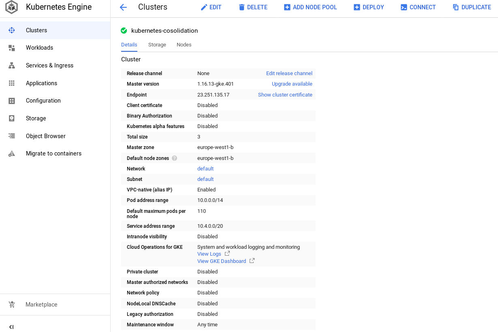
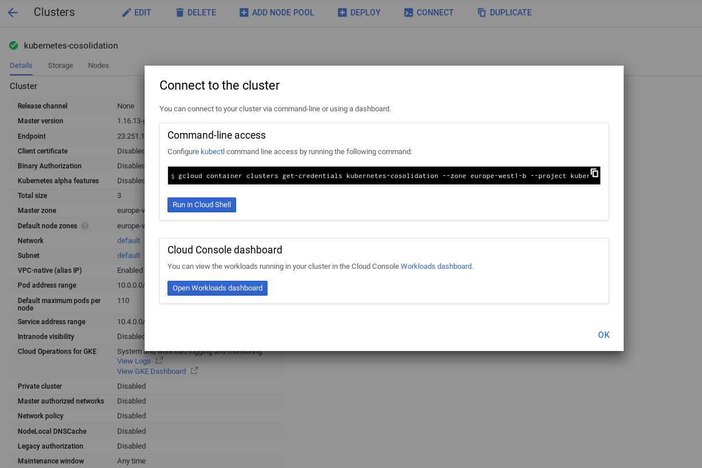
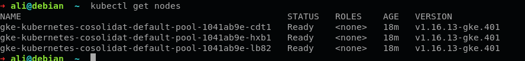
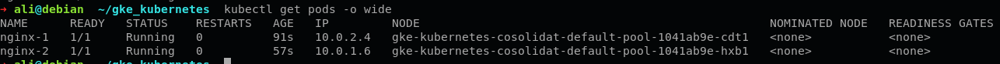

Google Cloud Platform
---

In here, we'll show you how to setup a kubernetes cluster in [GCP](https://console.cloud.google.com/).

##### Kubernetes Engine
In order to create a kubernetes cluster, follow the below steps:

1. Create a New project in you dashboard.

2. Choose `Kubernetes Engine` from `Compute` section in the gcp dashboard.


3. You have to go to the this page:


4. In order to create a new cluster, push `Create cluster` botton. You can choose the version of kubernetes which you want to use and Zone of your cluster.


5. You can choose the number of workers in `NODE POOLS` section:
select `default-pool` 


6. Select the `Nodes` section from `default-pool`.
_(If you want to customize the specifications (e.g. `RAM` and `vCPU`) of nodes do this)_  


7. Push `Create` button and wait for creating cluster. After a few minutes you can see something like this


8. You can see the details of your cluster by clicking the name of your cluster.


**Your Kubernetes Cluster is ready now.**

Connect to the Cluster
---
We want to connect to the cluster from our computer, so we need to configure [`gcloud SDK`](https://cloud.google.com/sdk/gcloud/) in our system.

- [Installing Google Cloud SDK](https://cloud.google.com/sdk/docs/install)

Now it needs to configure the `kubectl` to access to our cluster. We can get the credentials of our cluster by pushing the `Connect` botton in dashboard
 
copy the command-line access and run it into you terminal to create the config file of your cluster in `~/.kube/config` path.

Opening utilization-server Port in the firewall (gcloud)
---
ّImportant step: We need to open to access to port of utilization-server from outside the cluster:
```bash
UTILIZATION_PORT=30000
gcloud compute firewall-rules create utilization-server-node-port --allow tcp:${UTILIZATION_PORT}
```

kubectl
---

In order to see you nodes, run the following command in your system:
```bash
kubectl get nodes
```
- you can see something like this:


we want to run a pod in a specific node, so write the following content into file with name `nginx_node_1.yaml`:
```yaml
apiVersion: v1
kind: Pod
metadata:
  name: nginx-1
  labels:
    web: nginx
spec:
  containers:
  - name: nginx-1
    image: nginx
    imagePullPolicy: IfNotPresent
  nodeName: gke-kubernetes-cosolidat-default-pool-1041ab9e-cdt1
```

Run the command below to start a pod:
```bash
kubectl apply -f ./nginx_node_1.yaml
```

- run `kubectl get pods -o wide` and then you can see something like this:

