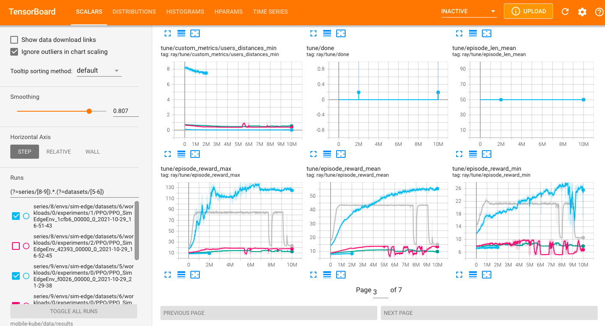

# Activting tensorboard

If you are running tensorboard locally:

1. open a tmux window
2. tensorboard --port=6008 --logdir= [path to the data folder] /results

If your are running tensorboard on a ssh host:

1. On your external host
   1. open a tmux window
   2. tensorboard --port=6006 --logdir= [path to the data folder] /results
   3. close the tmux
2. On you local machine
   1. open a tmux windonw
   2. ssh -N -f -L localhost:6006:localhost:6006 [user]@[remote-host]

# Using tensorboard

To filter out certain experiments with different dataset, workload, network and trace use the following regex format:

(?=series/[8-9]).*.(?=datasets/[5-6]) for selecting series 8 to 9 and datasets 5 to 6

