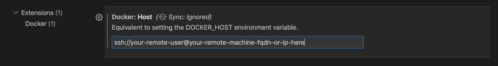

# setup the the environment in EECS servers

1. Load the [conda](https://docs.conda.io/en/latest/miniconda.html) and cuda
   ```
   module load cuda/10.2-cudnn7.6.5
   module load anaconda3
   ```
2. Create conda virtual-environment
   ```
    conda create --name pycloudsim python=3
   ```
3. Activate conda environment
   ```
    conda activate pycloudsim
   ```


   
2. ssh into your remote server and set up a container based on the image you have built before, also don't forget to bind your project volume to the container instance.
   ```
   docker run -d -it --name devcontainer --mount type=bind,source="$(pwd)"/target,target=/app devimage
   ```
3. error 1
```
   Running setup.py install for dm-tree ... error
```
open cv and dm_tree, solution -> wait for opencv and upgrade pip for dm_tree
4. error 2
```
>>> import ray.rllib.agents.pg as pg
   Traceback (most recent call last):
     File "<stdin>", line 1, in <module>
     File "/homes/sg324/python-envs/development/lib/python3.8/site-packages/ray/rllib/__init__.py", line 5, in <module>
       from ray.rllib.env.base_env import BaseEnv
     File "/homes/sg324/python-envs/development/lib/python3.8/site-packages/ray/rllib/env/__init__.py", line 1, in <module>
       from ray.rllib.env.base_env import BaseEnv
     File "/homes/sg324/python-envs/development/lib/python3.8/site-packages/ray/rllib/env/base_env.py", line 3, in <module>
       from ray.rllib.env.external_env import ExternalEnv
     File "/homes/sg324/python-envs/development/lib/python3.8/site-packages/ray/rllib/env/external_env.py", line 7, in <module>
       from ray.rllib.utils.annotations import PublicAPI
     File "/homes/sg324/python-envs/development/lib/python3.8/site-packages/ray/rllib/utils/__init__.py", line 10, in <module>
       from ray.rllib.utils.numpy import sigmoid, softmax, relu, one_hot, fc, lstm, \
     File "/homes/sg324/python-envs/development/lib/python3.8/site-packages/ray/rllib/utils/numpy.py", line 2, in <module>
       import tree
     File "/homes/sg324/python-envs/development/lib/python3.8/site-packages/tree/__init__.py", line 48, in <module>
       from tree import _tree  # pylint: disable=g-import-not-at-top
   ImportError: /homes/sg324/python-envs/development/lib/python3.8/site-packages/tree/_tree.cpython-38-x86_64-linux-gnu.so: undefined symbol:   _ZNSt13runtime_errorC2EPKc
   >>> 
```
